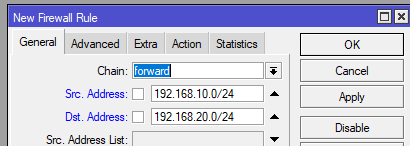

- No default config
- Stworzyć dwa bridge i przypisać do każdego z nich po porcie (np bridge1 ma port eth2, bridge2 ma port eth3 a jestesmy polaczeni na interfejsie eth4)
- Przypisać IP w różnych sieciach na bridge (np bridge1 192.168.10.1 a bridge2 192.168.20.1)
- MikroTik domyślnie routuje różne sieci i ping przechodzi
- Wchodzimy w IP -> Firewall
- W zakładce `Filter Rules` klikamy plus
	- W zakładce `general` dajemy src address na 192.168.10.0/24 i DST address na 192.168.20.0/24
	  
		W zakładce `Action` wybieramy `drop`
		![[mtik_firewall_2.png]]
	- Robimy to samo tylko robimy SRC i DST address na odwrót
- Adresujemy kompy w sieciach (ważne by ustawić gateway)
- Pingi nie będą przechodzić