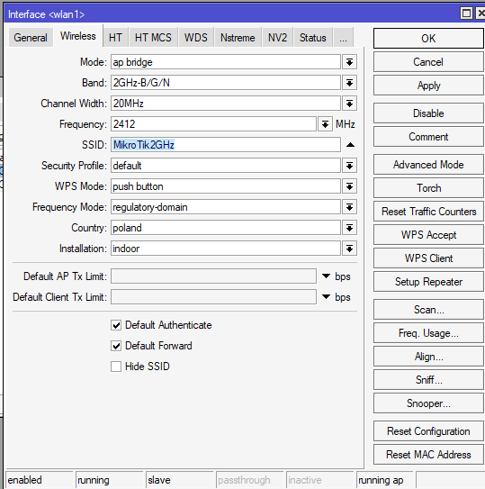
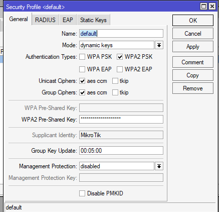
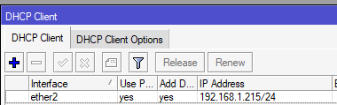
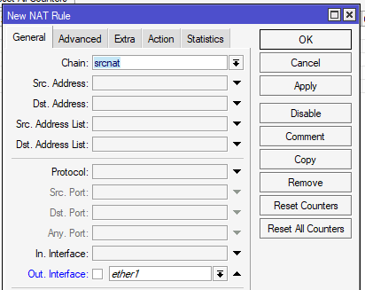
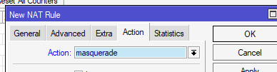

- no default config bo grzeczne dzieci tak robią
- stworzyć bridge, przypisać do niego jakiś port(byle nie eth1) oraz wlan1
- przypisać IP do bridge
- wejść w wireless -> wireless, zakladke `wifi interfaces` kliknać w wlan1 i wejść w zakładkę Wireless
- tak powinna wyglądać konfiguracja(mode na apbridge, band na 2ghz bgn, ustawic jakies ssid, country na poland i installation na indoor)
- 
- jak wlan1 nie jest włączony to kliknąć prawym na wlan1 i zrobić enable
- w wireless wejść do security profiles, kliknac na default, tak ustawic config(mode na dynamic keys, authentication wybrac wpa2 psk i ustawic jakies hasło)
  - 
- podłączyć eth1 do puszki i puszke do netgeara
- wejsc w IP -> DHCP client, plusik i ustawić na eth1 (zaznaczyc obydwie, use peer dns pobiera dnsa z netgeara)
- Zaczekać chwile i zobaczyć czy eth1 dostało ip(tu mam eth2 i inne ip bo tak mam w domciu)
- 
- wejsc w ip -> firewall, zakładka `NAT` kliknac plusik i nową regułe 
- chain ustawic na srcnat, out interface na ether1
- 
- wejsc w `action` i wybrac masquerade
- 
- potem wejsc w ip, dhcp server i zrobic setup na bridgeu (chyba powinno działac, ale jak nie ma neta to podczas dhcp mozna dodac wlasnego dnsa, np 1.1.1.1 lub 8.8.8.8)
