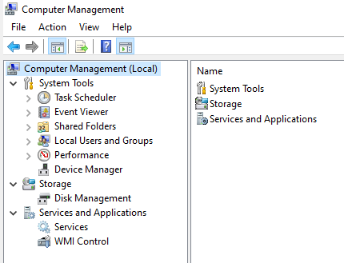
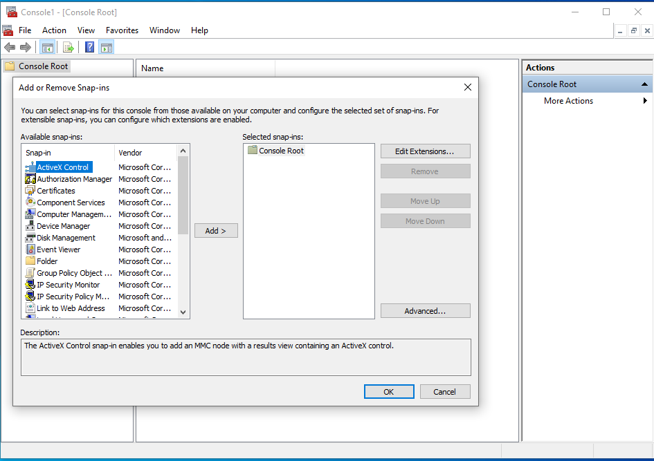

# Wywoływanie
Większość przystaweczek wywołujemy przez wpisanie ich nazw w oknie uruchom które wywołuje się przez kombinację klawiszy `win + r`

# Przystaweczki

[!IMPORTANT]
Realistycznie zdecydowaną wiekszość potrzebnych przystawek znajdziemy w **compmgmt.msc** i **mmc**
## compmgmt.msc

Przydatna przystawka, bo mamy w niej zawarte kilka ważnych przystawek. Ich lista znajduje się poniżej:

- [taskschd.msc](#taskschd.msc)
- [eventvwr.msc](#eventvwr.msc)
- [fsmgmt.msc](#fsmgmt.msc)
- [lusrmgr.msc](#lusrmgr.msc)
- [perfmon.msc](#perfmon.msc)
- [devmgmt.msc](#devmgmt.msc)
- [diskmgmt.msc](#diskmgmt.msc)
- [services.msc](#services.msc)
- - cos do kontrolowania WMI

   

## mmc

Kolejna bardzo fajna przystawka, klikamy file i potem add/remove snap-in (lub ctrl+m) i możemy sobie dodać kilka przystawek do widoku gdy zapomnimy nazwy

   
## taskschd.msc

Harmonogram zadań, pozwala na zarządzenie i automatyczne wykonywanie zadań
## eventvwr.msc

Dziennik zdarzeń, pokazuje logi systemu i aplikacji (szczególnie przydatne kiedy nie działa nam coś na windowsie server i chcemy info do debugowania)
## fsmgmt.msc

Zarządzadznie udziałami/udostępnionymi 
## lusrmgr.msc

Zarządzanie, tworzenie i usuwanie użytkowników i grup na **lokalnym** komputerze (tzn w domenie sie nie da z tego korzystać)
## perfmon.msc

Pokazuje wykorzystanie podzespolow komputera
## devmgmt.msc

Do sterownikow i podłączonych urządzeń/peryferiów do komputera
## diskmgmt.msc

Zarządzanie dyskami i partycjami(woluminy, formatowanie, zmniejszanie/zwiększanie itp.)
## services.msc

Do zarządzania usług w windowsie
## secpol.msc

Polityki do haseł, zabezpieczeń, logowania sięi itd
## gpedit.msc

Zaawansowana konfiguracja i chyba najgłebszą przystawka w której łatwo się pogubić

Generalnie najbardziej nas obchodzi zakładka `Administrative Templates` i w użytkowniku i w komputerze (może z wyłączeniem podkategorii `Windows Components`. Nie znaczy że nie może być niepotrzebna. Np w `File Explorer` mamy opcje żeby ukryć określone dyski.) Jeśli nam każa zmapować dysk to jest to w konf użytkownika, preferencjach, ustawieniach windowsa i tam bedzie mapowanie dysku

Koniec konców, w gpedicie trzeba po prostu umieć dobrze klikać. Powodzenia.
## printmanagement.msc

Zarządzanie drukowaniem
## regedit

Edytor rejestru. 

Jak proszą nas o zrobienie kopi zapasowej danego klucza to klikamy na niego prawym i eksportujemy
## msconfig

Konfiguracja rozruchu (tryb awaryjny itp.), serwisy oraz linki do kliku narzędzi systemowych
## msinfo32

Info komputerze i jego parametrach. Chyba najbardziej dokładna przystawka do identyfikacji podzespołów, jest tu takie losowe info jak np ram virtualny, stan TPM i inne takie
## resmon

Bardziej dokładne monitorowanie zasobów komputera niż perfmon

## optionalfeatures

Można dodać/wyłączyć funkcje w windowsie (np HyperV, windows sandbox, client telnet)

## dxdiag

Info o directx i troche o GPU