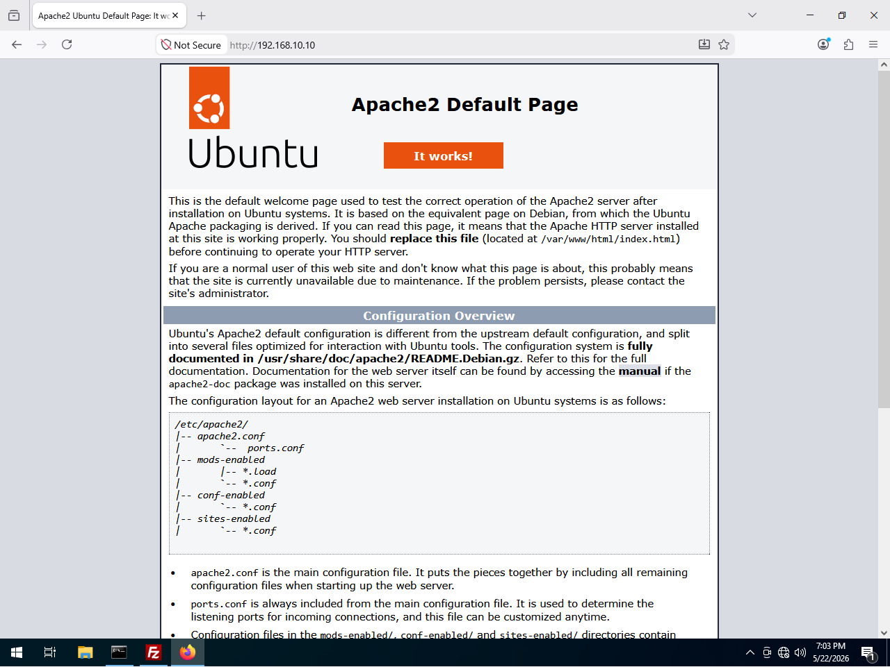
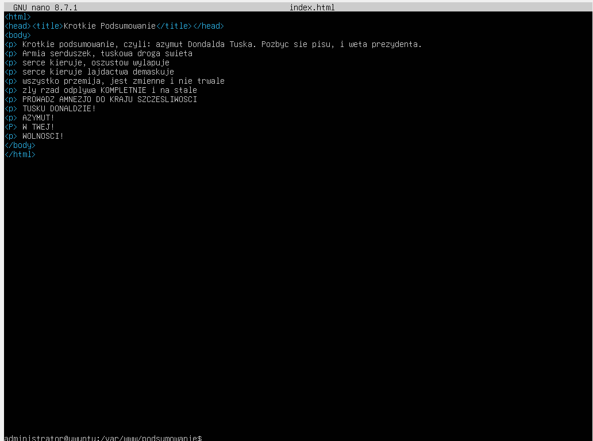
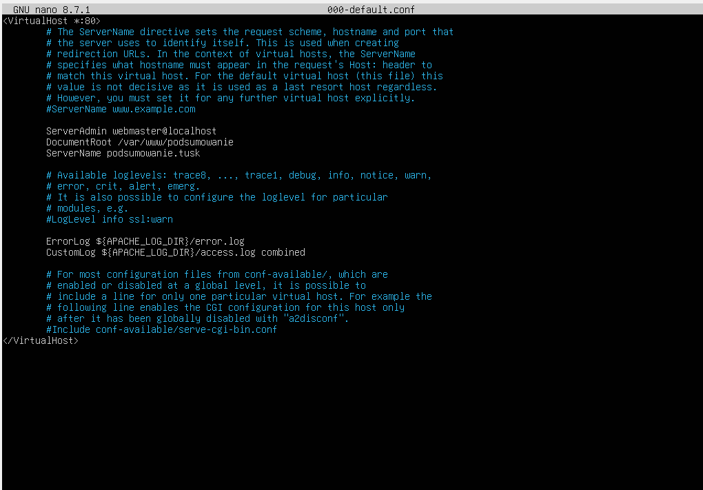
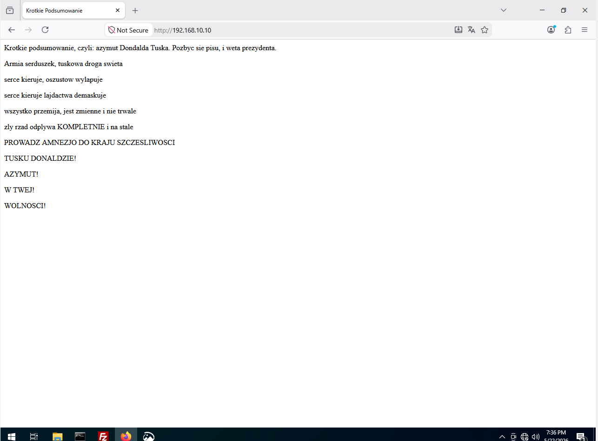

https://ubuntu.com/tutorials/install-and-configure-apache#2-installing-apache
pakiet: apache2

# Instalacja (nie ważne na egzaminie)
Bierzemy internet z puszki, i instalujemy powyższy pakiet

# Firewall
Robimy `sudo ufw allow http` oraz `sudo ufw allow https`

# Sprawdzenie

Po powyższych czynnościach, jeśli wejdziemy na adres ip serwera z przeglądarki klienta to powinno się nam wyświetlić takie coś:

   
     

# Tworzenie strony

Pliki do stron są przechowywane w katalogu `/var/www` a domyślna strona jest w `/var/www/html`

Aby stworzyć nową stronę, najpierw tworzymy folder:

`sudo mkdir /var/www/podsumowanie/`

Potem do niego wchodzimy i tworzymy jakąś przykładową strone:
`cd /var/www/podsumowanie/`
`sudo nano index.html`

Piszemy tam jakiegoś htmla:
   
     

Musimy też nadać uprawnienia użytkownikowi www-data:
`sudo chown -R www-data:www-data /var/www/podsumowanie`
`sudo chmod -R 755 /var/www/podsumowanie`

# Edycja konfigu

robimy `sudo nano /etc/apache2/sites-available/000-default.conf`

w linijce `DocumentRoot` adekwatnie zmieniamy lokalizacje pliku 
dopisujemy linijke `ServerName` i wpisujemy tam jakis adres strony (w sumie nwm po co to ale dobra no coz)

   

Zapisujemy plik i  używamy komendy `sudo systemctl restart apache2` do zrestartowania serwisu i `sudo systemctl status apache2` żeby sprawdzić czy wszystko działa

Po restarcie, na kliencie po wejsciu na ip serwera powinna sie wyswietlic nowa strona

   