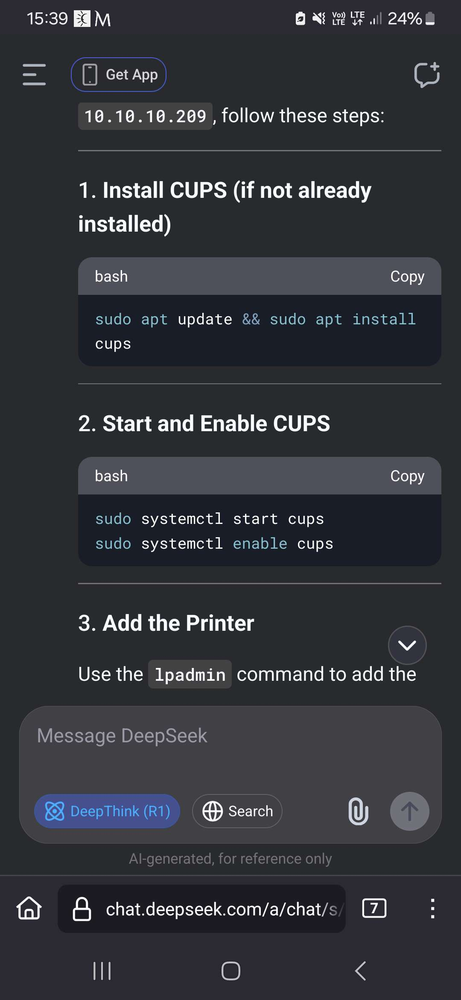
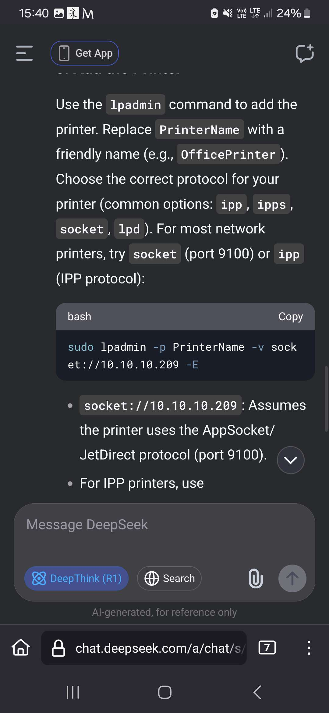
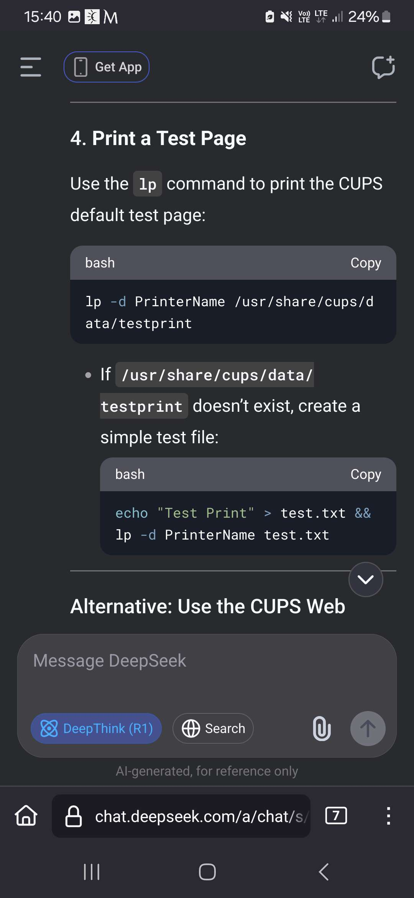

cos co mi gemini wyplulo:
- **`lpstat -p -d`** Lists all available printers and shows the current default printer.
    
- **`lpadmin -p [printer_name] -E -v [device_uri] -m [ppd_name]`** Adds/modifies a printer and enables it (`-E`).
    
- **`lpadmin -x [printer_name]`** Deletes a printer.
- ### Managing Print Jobs

- **`lp -d [printer_name] [filename]`** Prints a specific file to a specific printer. (Leave out `-d` to use the default printer).
    
- **`lpq`** Shows the current print queue status.
    
- **`lprm [job_id]`** Cancels a specific print job. Use `lprm -` to cancel all your jobs.
- **`/etc/cups/cupsd.conf`** The main configuration file. Controls network access, web interface permissions, logging levels, and security settings.
- - **`/etc/cups/printers.conf`** Stores the definitions and URIs of all installed printers. _Do not edit this while CUPS is running._
    
- **`/etc/cups/ppd/`** The directory containing PostScript Printer Description (PPD) files for every installed printer. These files define what features (like duplex or color) your printer supports.
    
- **`/var/log/cups/`** The log directory. Crucial for troubleshooting:
    
    - `access_log`: Records HTTP/Web UI requests.
        
    - `error_log`: The holy grail for debugging failed print jobs. (Tip: set `LogLevel debug` in `cupsd.conf` for more details).

dziala na porcie 631

jak remote admin nie dziala:
sudo cupsctl --remote-admin --remote-any 
sudo systemctl restart cups
# ???
tego nie zrobilem bo pewien pan byl na hawajach. sa tu jakies screeny jak to zrobic ktoreee CHYBA dzialaly ale sam nie wiem no kurde no

