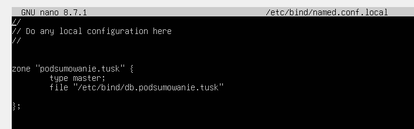

https://ubuntu.com/server/docs/how-to/networking/install-dns/
pakiet: bind9

# Instalacja (nie ważne na egzaminie)
Bierzemy internet z puszki, i instalujemy powyższy pakiet

# Konfiguracja

Plik konfiguracyjny znajduje się w  `/etc/bind/named.conf.local` wchodzimy tam

`sudo nano /etc/bind/named.conf.local` 

Wpisujemy tak jak na obrazku  (`podsumowanie.tusk` zastapiamy adresem jaki chcemy)

     
    

Teraz kopiujemy plik strefy 
`cp /etc/bind/db.local /etc/bind/db.podsumowanie.tusk`