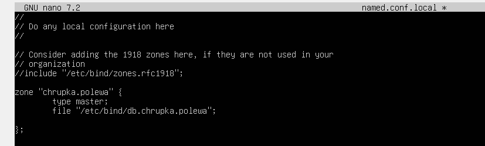
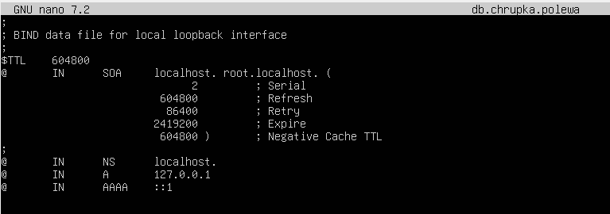
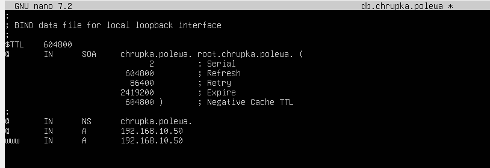
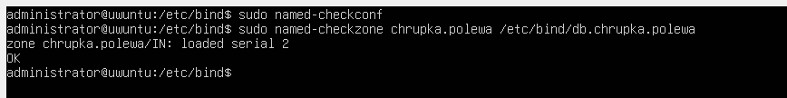
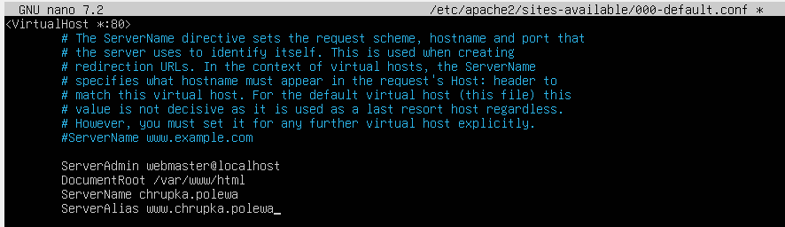
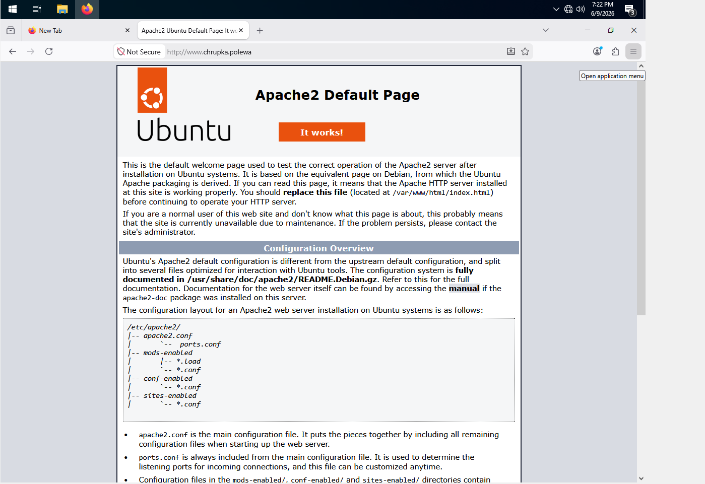

https://ubuntu.com/server/docs/how-to/networking/install-dns/
pakiet: bind9

[rekomendowana piosenka](https://www.youtube.com/watch?v=qaXuDejs-zo)
# Instalacja (nie ważne na egzaminie)
Bierzemy internet z puszki, i instalujemy powyższy pakiet

# Konfiguracja

Plik konfiguracyjny znajduje się w  `/etc/bind/named.conf.local` wchodzimy tam

`sudo nano /etc/bind/named.conf.local` 

Wpisujemy tak jak na obrazku  (`chrupka.polewa` zastapiamy adresem jaki chcemy)

     
    

Teraz kopiujemy plik strefy

`cp /etc/bind/db.local /etc/bind/db.chrupka.polewa`

Edytujemy plik strefy, domylsnie wyglada on tak:

     
    

Zamieniamy wszystkie wzmianki `localhost` na nasz adres (`chrupka.polewa`), zostawiamy kropki na koncach. W ostatnich dwoch linijkach zamieniamy adres na adres na ktorym mamy np strone (`192.168.10.50`). W ostatniej linijce zamienami `@` na `www` a `AAAA` na `A` 

Jeśli chcemy np dodac zeby to byl adres to serwera ftp czy innej uslugi jeszcze np to zastepujemy/dodajemyt nowa taka sama linijke jak ostatnia ale zamieniamiy `www` na `ftp`

     

Możemy sprawdzić czy mamy jakieś błędy używając tych oto komend:

```
sudo named-checkconf
sudo named-checkzone mojadomena.local /etc/bind/db.mojadomena.local
```

Powinny one dac nic albo po prostu `OK`:


Teraz restartujemy i patrzymy status:

`sudo systemctl restart named bind9` oraz  `sudo systemctl status bind9` (nwm czy to nie sa aliasy tej samej rzeczy)

## Apasz

Jak robimy dnsa do strony apache to musimy zedytowac jej config (np `/etc/apache2/sites-available/000-default.conf`): 

       

Co robimy to dodajemy linijke `ServerName` z adresm naszej strony oraz `ServerAlias` z adresem naszej strony poprzedzonym `www.`

Jak to zrobimy to musimy tez zrestartowac apache2

# Testowanie

Jak chcemy przetestowac DNS na serwerze to w netplanie też musimy ustawić DNSa na localhosta i/lub nasze ip statyczne bo inaczej ni pujdzie
# Korzystanie

Na kliencie oczywiscie ustawiamy adres DNS na adres serwera, odpalamy przegladarke i wpisusjemy nasz adres. Czasami przegladarka moze nie byc zadowolona i musimy wpisac caly adres z lapy, tzn: `http://www.chrupka.polewa`

