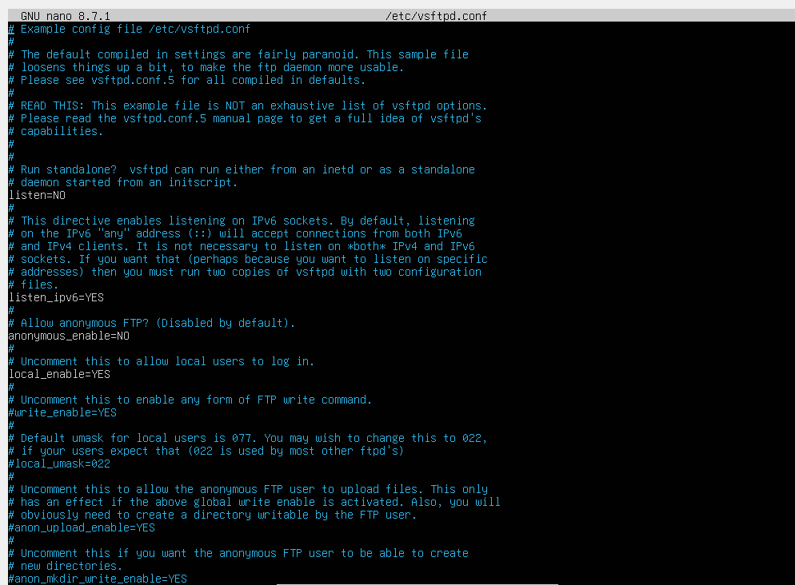
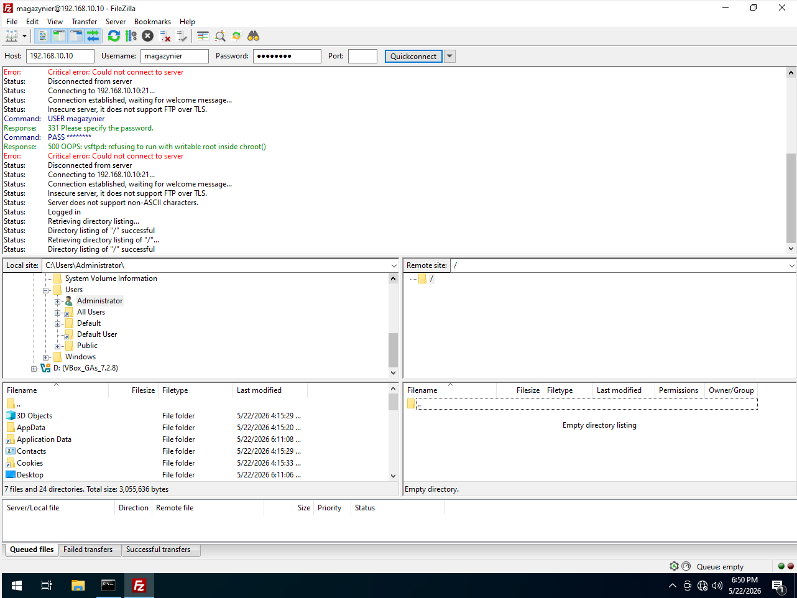

https://ubuntu.com/server/docs/how-to/networking/ftp/
pakiet: vsftpd

# Instalacja (nie ważne na egzaminie)
Bierzemy internet z puszki, i instalujemy powyższy pakiet

# Firewall
jeśli nie zmieniamy portu, to zezwalamy na usługę używając komendy `sudo ufw allow ftp`

# Konfiguracja

## Plik do configu
Plik konfiguracyjny do FTP znajduje się w `/etc/vsftpd.conf`   

    
Generalnie jest w nim trochę opcji i dużo z nich jest wytłumaczone komentarzami, ale wyłuumaczę najważniejsze:

- `anonymous_enable` (YES/NO) - opcja pozwala na logowanie się jako użytkownik anonymous i pobieranie tak plików 
- `anon_upload_enable` (YES/NO) - opcja pozwala na anonimowym użytkownikom uploadowanie plikó
- `write_enable` (YES/NO) - pozwala użytkowniką na uploadowanie plików
- `chroot_local_user` (YES/NO) - limituje użytkownikód do ich katalogów domowych
- `allow_writeable_chroot` (YES/NO) - pozwala zapisywac pliki w roocie katalogu domowego
- `ssl_enable` (YES/NO) - zmusza użytkownikód do korzystania z SSL 

Ja w configu włączyłem `write_enable`, `chroot_local_user` i `allow_writeable_chroot` (bez tego ostatniego nie można się zalogować bezpośrednio do katalogu domowego)
## Lokalizacja plików i użytkownicy

Pakiet domyślnie tworzy użyszkodnika `ftp` i jego domyślny home jest w `/srv/ftp` i to jest domślna lokalizacja FTP.

Aby zmienić lokalizacje to robimy np:
`sudo mkdir -p /srv/files/ftp`
`sudo usermod -d /srv/files/ftp ftp` (ta komenda zmienia home ftpa na nowo utworzony folder)

Analogicznie jeśli tworzymy customowego użytkownika i chcemy żeby miał homea gdzie indziej to robimy:

`sudo useradd -m -d /magazyn magazynier`
`sudo passwd magazynier` (ustawiamy haslo zeby sie moc zalogowac)

Po konfiguracji pliku i lokalizacji, używamy komendy `sudo systemctl restart vsftpd` do zrestartowania serwisu i `sudo systemctl status vsftpd` żeby sprawdzić czy wszystko działa

# Łączenie (Filezilla)

Po upewnieniu się, że mamy łączność z serwerem na kliencie odpalamy filezille     

Opcje które mamy do wpisania
- Host - podajemy tu IP serwera z filezillą
- Username - wpisujemy to nazwę użytkownika
- Password - hasło do użytkownika
- Port - można zostawić puste, ale dla ftp to 21

   

Potem klikamy `quickconnect` i powinno działać