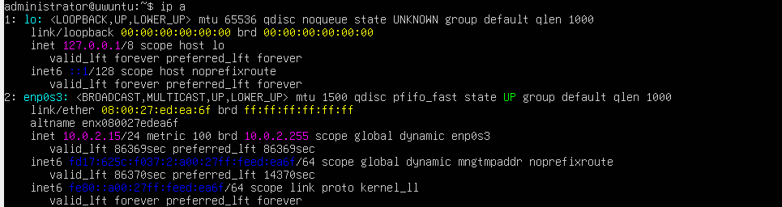
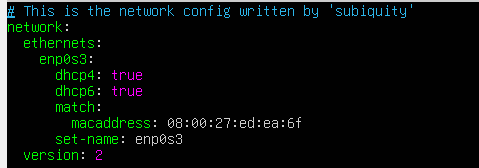
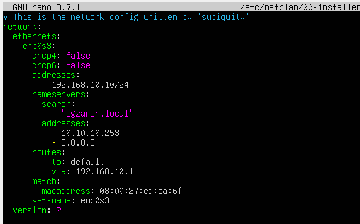

# Identyfikowanie interfejsu
`ip a` pokazuje wszystkie interfejsy sieciowe. Ten który ma przy sobie nazwę up jest obecnie aktywny/podłączony  

    
# Netplan
## Lokalizacja
Plik do netplana znajduje się w lokalizacji `/etc/netplan` a jego domyślny config ma nazwę `00-installer-config.yaml`   


   
Warto utworzyć kopię - `sudo cp /etc/netplan/00-installer-config.yaml /etc/netplan/00-installer-config.yaml.backup`)   


## Domyślny config
Po świeżej instalacji serwera config istnieje ale jest głównie pusty i wygląda mniej więcej tak:   



(Tutaj może się trochę różnić bo jest na vmce - na faktycznym sprzęcie może nie być sekcji `match` oraz są podane dwie karty sieciowe)

## Edytowanie

Gdy w netplanie dodajemy kolejną sekcje, dodajemy ją tak że litery w następnej sekcji są poprzedzone dwoma spacjami względem poprzedniej, tzn:
```
linia1
  linia2
    linia3
```

## Konfigurowanie

Tak oto wygląda oto kompletnie skonfigurowany netplan    


    

### Wytłumaczenie sekcji
- dhcp4: opcja sama się tłumaczy, ustawiamy na false lub true
- addresses: tu ustawiamy adres ip, w formacie - adres_ip/maska w formacie dziesietnym
- nameserves: tu ustawiamy dnsy
	- search: tu podajemy tekstowy adres dnsa
	- addresses: tu podajemy liczby adres dnsa
- routes: tu ustawiamy gateway (`to: default` zawsze dajemy)

Po skonfigurowaniu netplana, zapisujemy plik i wpisujemy komendę `sudo netplan apply`. Jeśli dobrze go skonfigurowalismy, to nie wywali żadnego błędu i w `ip a` wyświetli się nam ustawiony adres ip