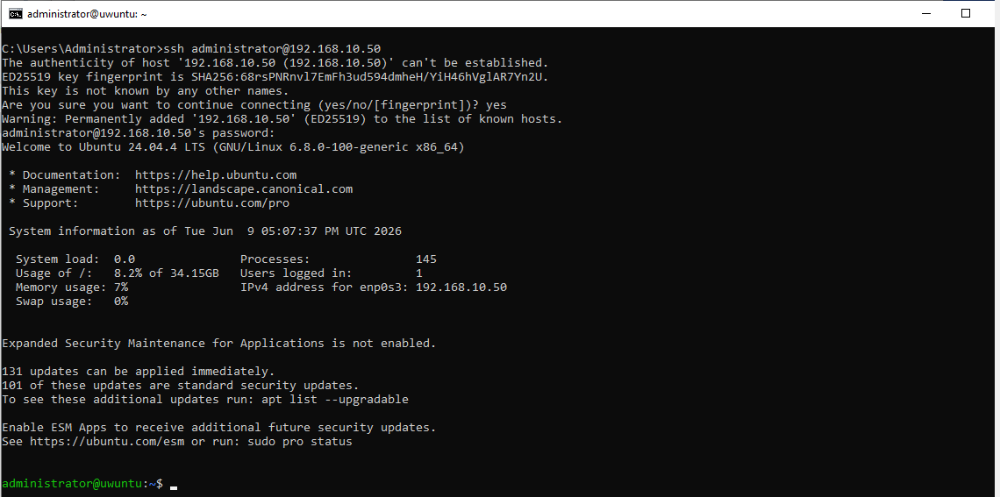

pakiet: openssh-server

[rekomendowana muzyka](https://www.youtube.com/watch?v=pGfYwI6omHk)
# Instalacja (nie ważne na egzaminie)
Bierzemy internet z puszki, i instalujemy powyższy pakiet

# Firewall
Robimy `sudo ufw allow ssh` (chyba ze ma dzialac na innym porcie, wtedy zamiast ssh wpisujemy nasz port) 

# Info

To powinno być dosłownie wszystko., moze oprocz startu uslugi (`sudo systemctl start ssh`).Jedyny arkusz z ssh to [ten](https://zawodowe.edu.pl/arkusz-praktyczny/inf02-2025-styczen-02/arkusz.pdf) i tu naprawde nie ma wiekszej filozofi, po zezwoleniu w firewallu ssh po prostu dziala. Uruchamianie automatyczne to `sudo systemctl enable ssh` i tyle. Jak co to config jest w `/etc/ssh/sshd_config`

# Łączenie się

Na cmd/terminalu wpisujemy tą oto komende(jak zmienilismy port to dajemy argument -p i po p wpisujemy nasz custowmowy port):

`ssh user@adres.ip` (np `ssh administrator@192.168.10.50`) 

Zapyta sie nam o cos za pierwszym razem, piszemy `yes`, podajemy hasło i WŁALA

   

