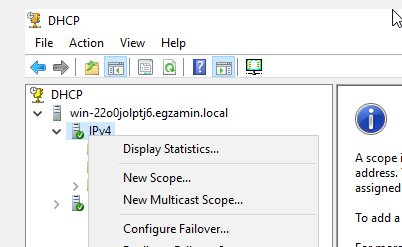
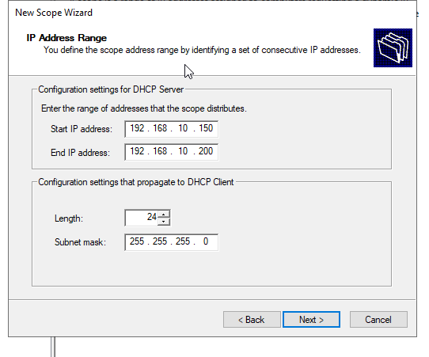
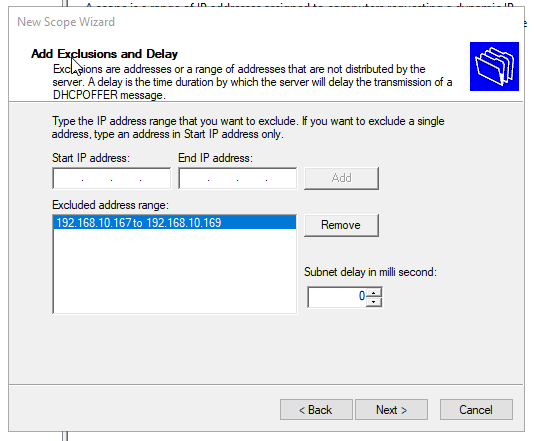
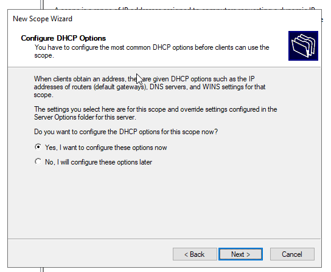

Instalujemy usługe, w zakładce `Tools` klikamy w `DHCP`

Rozwijamy, klikamy prawym na ipv4 i `New Scope`

     

Prosi nas o nazwe, dalej, dajemy zakres i maske

     

Tu mozemy wykluczenia skonfigurowac(TO NIE SA REZERWACJE!!!!)

      

Zapyta nas sie czy chemy wiecej skonfigurowac, klikamy ze tak (chyba ze nie potrzebujemy)

     

Zapyta nas sie najpierw o gatewaya a potem o DNSA (jak dodajemy z lapy to moze wywalic blad ale to mozna zignorowac bo to chodzi o to ze ten adres rozdaje)

Potem sie to zamknie i mozemy np rezerwacje skonfigurowac