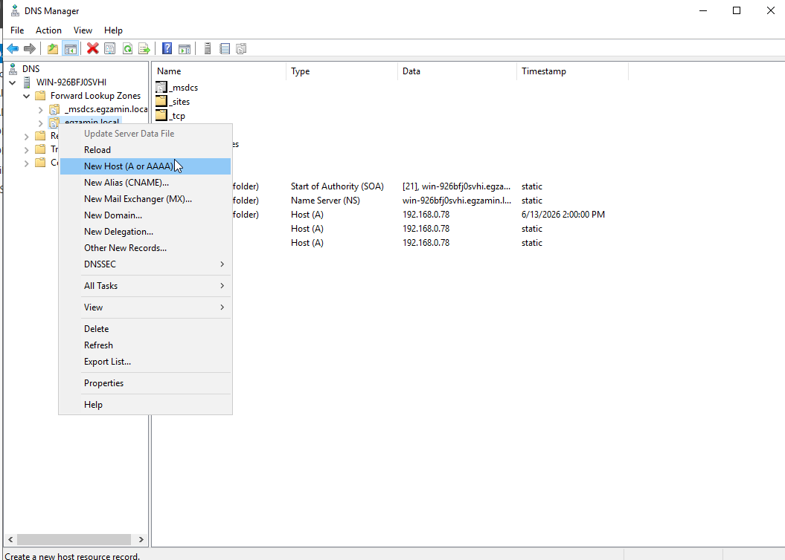
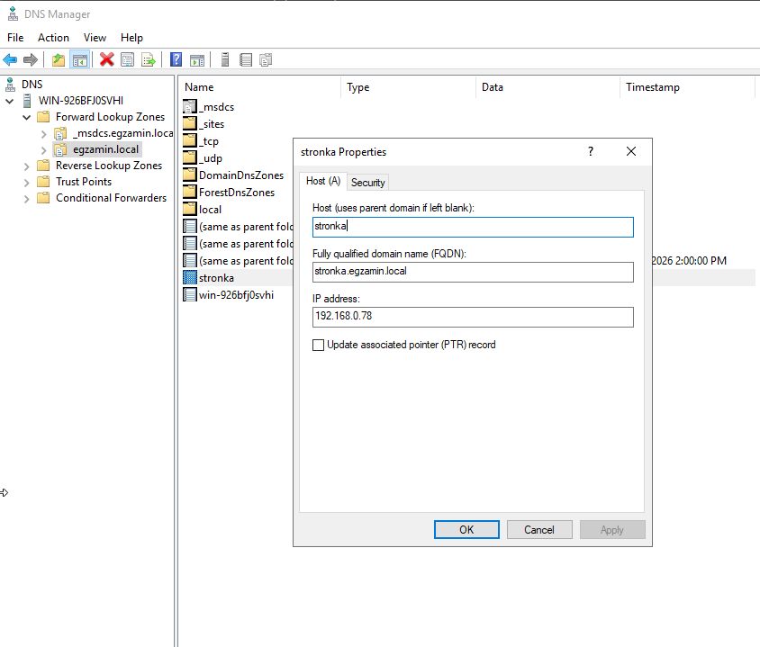

Dodaj role i funkcje > DNS

<<<<<<< Updated upstream
Wchodzimy Narzedzia > DNS, strefy wyszukiwania do przodu, prawym na zrobiona wczesniej domene ADDS egzamin.local > nowy host A

Nazwe dajemy taka jaka nam kaza w arkuszu, dajemy ip serwera i dziala,
jak sie wpisze w przegladarke stronka.egzamin.local to przejdzie na index.html napisany w czesniej

Gapcio mi nie placi, pomozcie mi
=======
generlanie nas obchodzi strefa wyszukiwania do przodu, rekord A::
>>>>>>> Stashed changes
