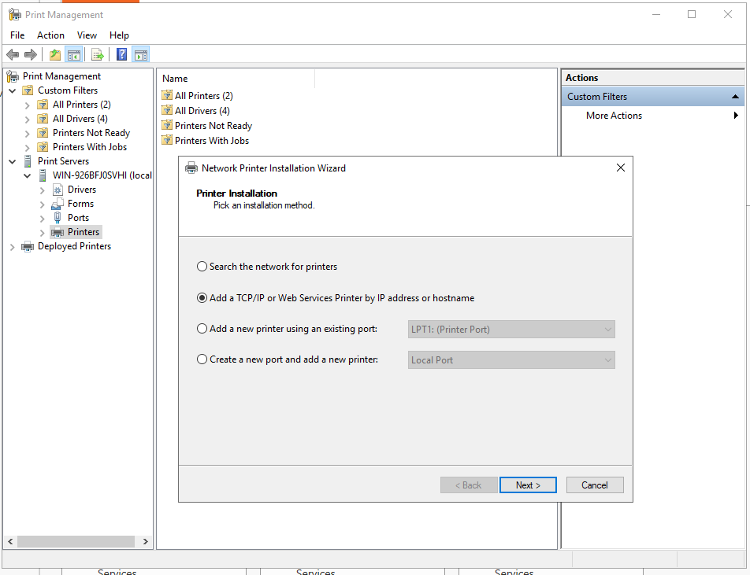
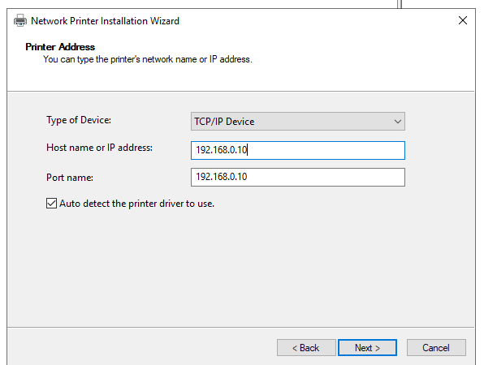
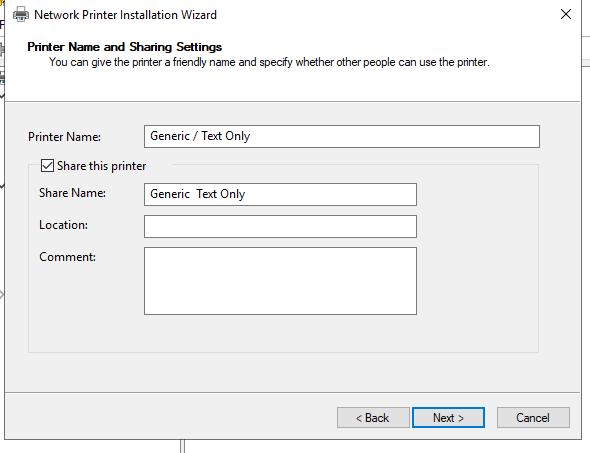

Gemini gotowalo, ja tylko przepisuje

Wchodzimy Dodaj role i funkcje, wybieramy Usługi drukowania i zarządzania dokumentami

Narzedzia > Zarządzanie drukowaniem > Po wybieramy Serwery Druku i klikamy w nasz serwer

PPM na Drukarki > dodaj drukarke > wybieramy zeby dodać po IP drukarki i zaznaczamy zeby automatycznie znalazl sterownik

Idziemy przez setup, potem nazywamy odpowiednio drukarke

