Dodanie domeny, jednostek organizacyjnych i uzytkownik jest tak banalne ze nie bede tego tu opisywal

# Profil mobilny/Folder macierzysty

Profil mobilny  (Profil mobilny) - przechowuje ustawienia użytkownika na serwerze
Folder macierzyty (Home folder) - prywatny katalog plikow uzytkownika, mozna zmapowac jako dysk sieciowy

Aby utworzyć, wchodzimy w użytkownikow i komputerow AD, klikamy prawym na uzytkownika, wlasciwosci, zakladka profil: (jesli ma sie utworzyc w danym folderze folder o nazwie uzytkownika to po \ mozemy zapisaca `%username%`)

Jeśli poproszą nas na ustawienie ścieżki profilu w udostępnionym zasobie to albo możemy z łapy to podać albo możemy wpisać coś podobne do tego: `\\serwer\nazwa_udzialu\%username%`

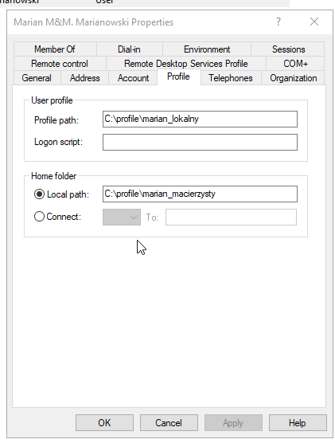

# Domenowe zasady grupy

Klikamy `win + r` i odpalamy `gpmc.msc` lub wchodzimy w menedżer serwera, narzędzia, group policy management i pojawi sie takie okno

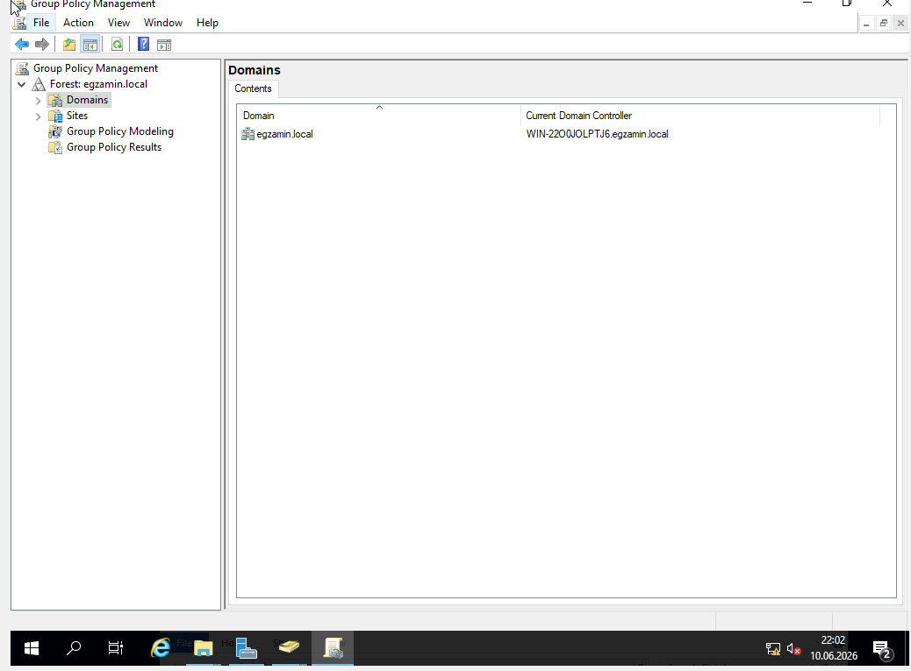
      
      

Rozwijamy nasza domeny i klikamy prawym albo na domene albo na jednostke organizacyjna i klikamy to na samej gorze

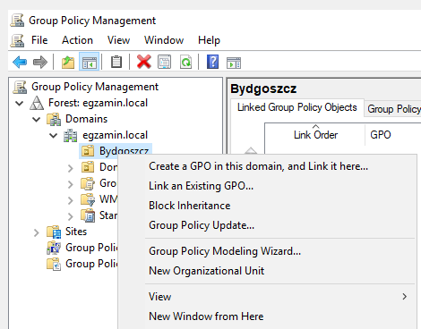

      

Nadajemy nazwe i jak klikniemy to mamy takie okno, jak klikemy prawym na to co stworzylismy to mamy edit i tam ustawiamy gpeditem zasady

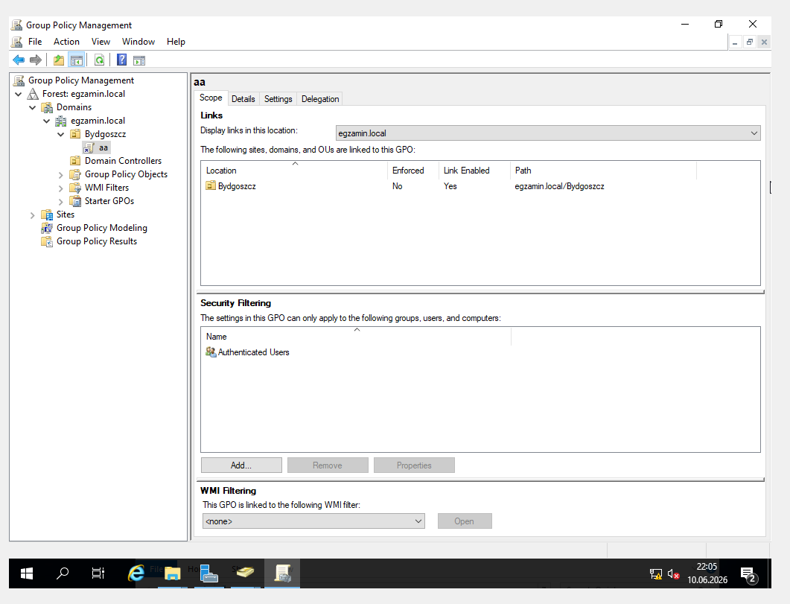
      

Potem klikamy na nasza jednostke prawym i mozemy zrobic update polityki(jest tez komenda `gpupdate force`. Tu jest tez secpol wiesz jak prosza o wymagania do hasla to tu.

# Przydziały dysku

Klikamy prawym na dysk, właściowiści, zakłada `quota` (po polsku to bedzie jakis przydzial albo cos) i mamy takie cos, opcje sie same tlumacza:

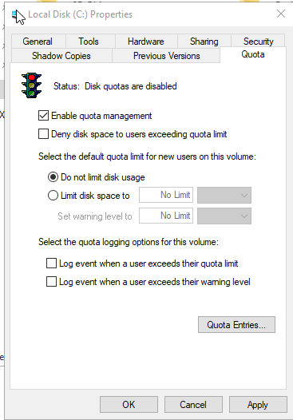
      
      

Jak mamy cos uzytkownikowi konkretnie ustawic to klikamy `quota entries`, klikamy w pierwsza zakladke po lewej `quota` i dodajemy nowy wpis, po dodaniu wyglada to tak:

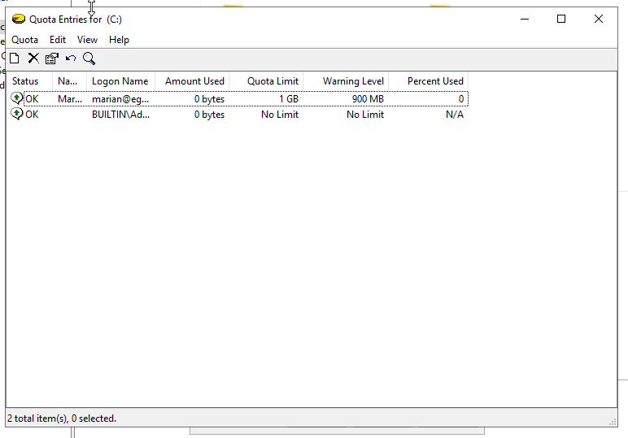
      
      
# Udostępnianie folderów

Zalozmy ze mamy folder `C:\WSPOLNY`

Klikamy na niego prawym, wlasciwosci i wchodzimy w druga zaklade `sharing` i klikamy `advanced sharing

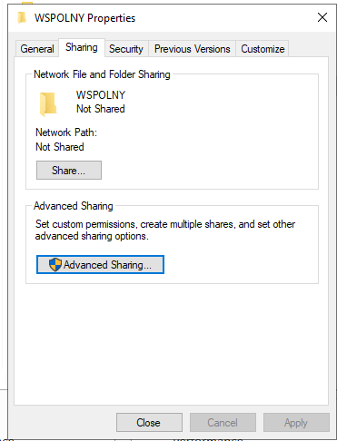
     

W tym oknie sobie konfigurujemy nazwe itd. 

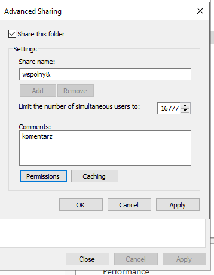
     

Jak klikniemy na `permission` to mozemy edytowac uprawnienia

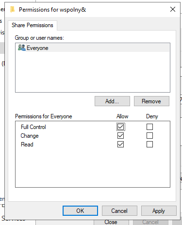

# Serwer Plików

Do podstawowego zasobu mamy chyba juz zainstalowane uslugi, wchodzimy w adekwatna zakladke w managerze i tworzymy nowy udzial

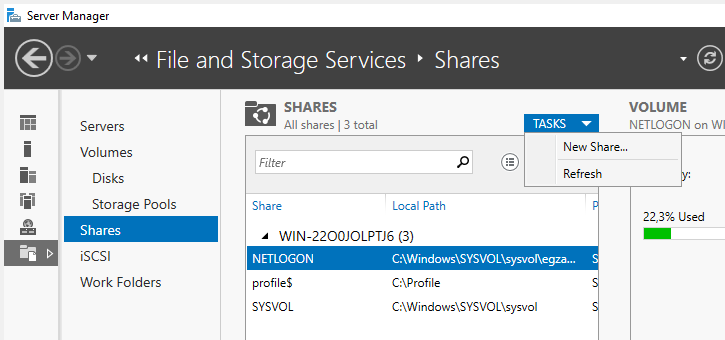
    

W pierwszym oknie wybieramy lokacje

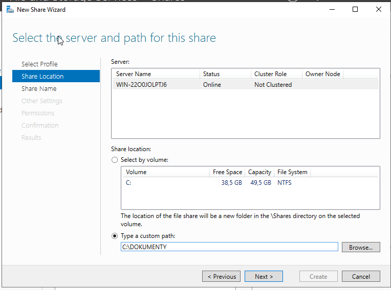
     

W drugim dajemy nazwe i opis

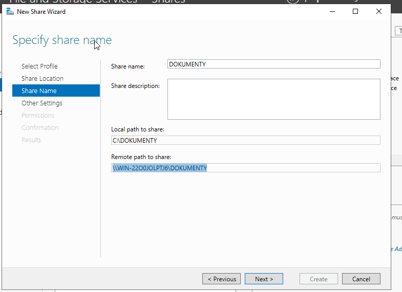
    

W nastepnym oknie konfigurujemy uprawnienia, i tyle. (nie jestem pewien ale jest tez opcja ze trzeba tez skonfigurowac osobne uprawnienia dla folderu a nie udzialu, tzn odpalamy explorer, klikamy prawym na nasz folder i tam uprawnienia robimy)

Jak nam kaza dac limit to w tym samym oknie w rogu jest `quota`, ale trzeba zainstalowac usluge wiec to klikamy

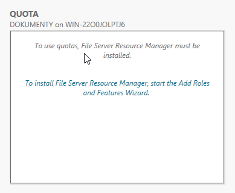
     

Po instalacji możemy skonfigurowac przydzialy

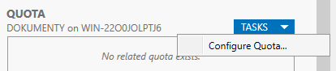
     

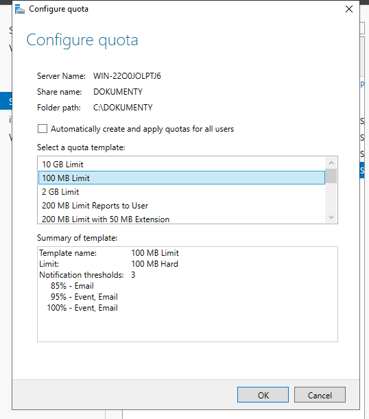
