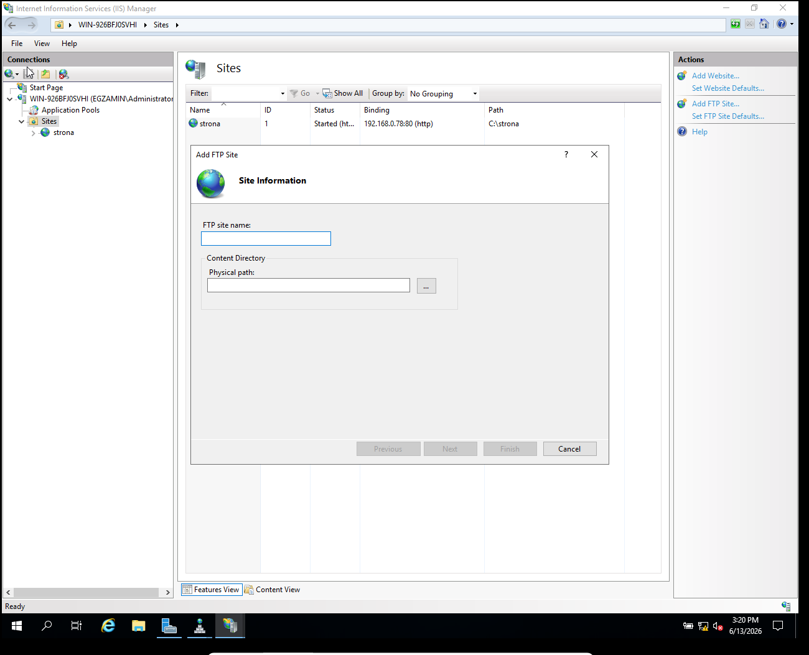
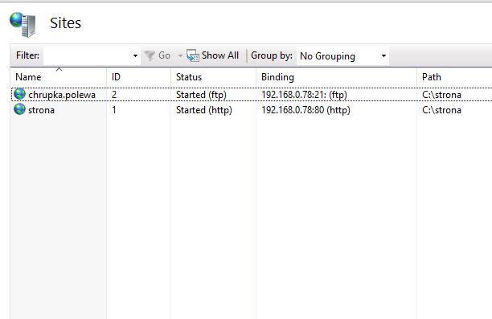
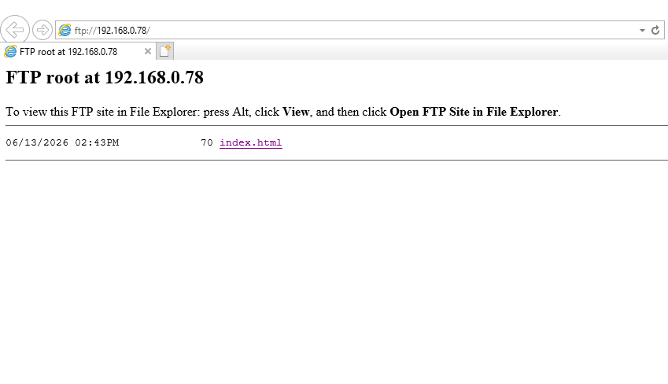

Instalujemy ISS ale wazne zeby podczas instalacji zaznaczyc server FTP. W narzedziach wchodzimy w menedzer IIS

Wchodzimy po prawej w serwer, potem po prawej Add FTP Site

Robimy folder z plikami dla ftp w C: , reszte wpisujemy wszystko tak jak nam kaza w arkuszu
(W binding wpisujemy ip serwera, no SSL, autoryzacja i permisje dla kogo nam kaza i to tyle)

Teraz jak wpiszemy w win+r albo przegladarce ftp://ip.serwera/ i zalogujemy sie na wybranego uzytkownika
powinnno to wygladac mniej wiecej tak

