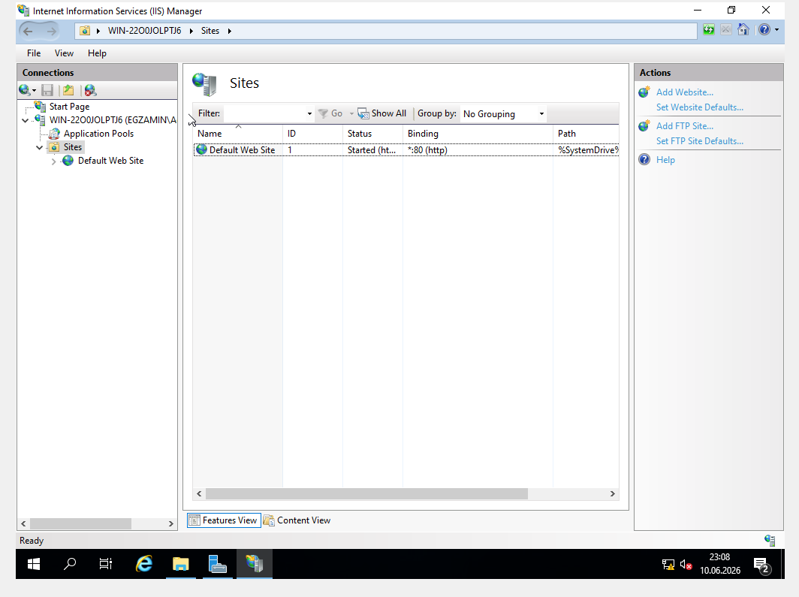
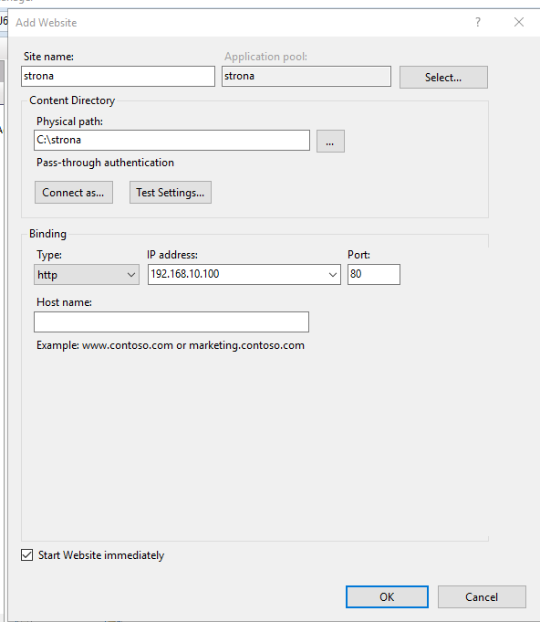
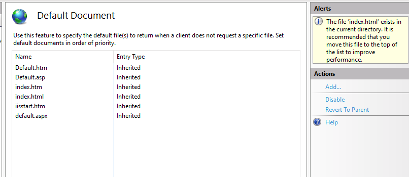

Wgrywamy usluge IIS i narzedziach wchodzimy w menedzer IIS

Mozna by wylaczyc/usunac domyslna strone bo ona nam z portem zawadza

Tworzy folder gdzie ma byc nasza strone i robimy tam jakis plik lub wypakowujemy to co nam cke dalo

     

Klikamy prawym na add website i konfigurujemy (NIE ustawiamy tutaj domeny bo to NIE zadziała), pamietajmy by ustawic tu adres ip

     

Jak strona glowna to nie jest index.html to po stworzeniu strony klikamy na nia dwa razy, szukamy Default document i trafiamy tutaj. Dodajemy nowy plik i przesuwamy go na gore

